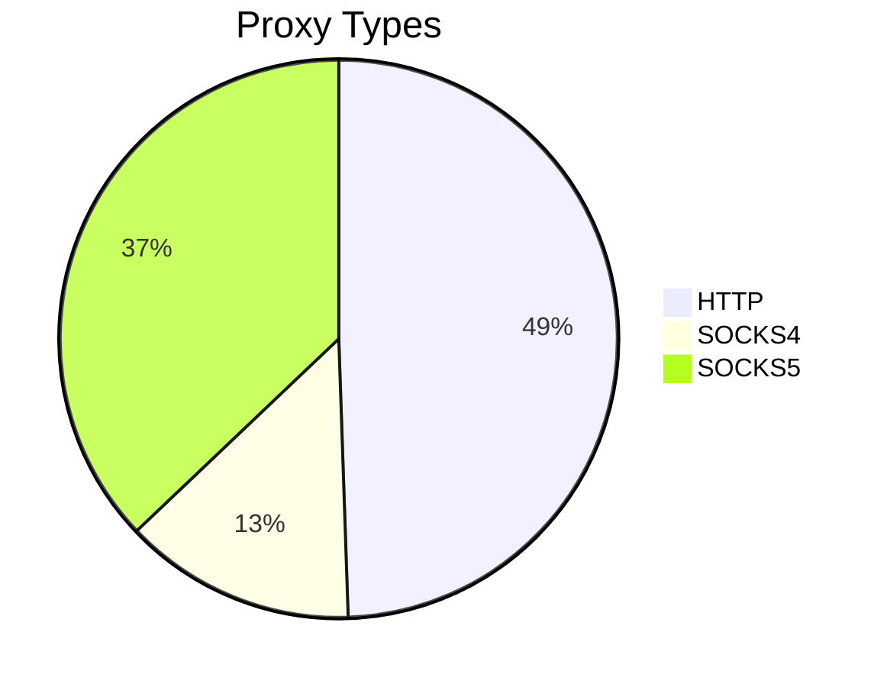
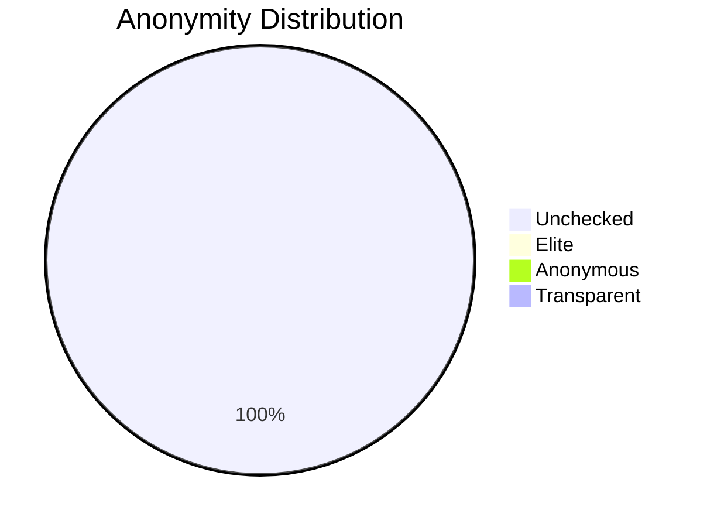

# 🚀 Proxy Collection

## 📊 Statistics

| Metric | Value |
|--------|-------|
| Total Checked | 61214 |
| Working | 186 |
| Success Rate | 0.3% |

## 📈 Proxy Types Distribution

## 🔒 Anonymity Levels

## 📝 Description

This repository contains an up-to-date list of verified and working proxies. The list is automatically updated every 30 minutes to ensure maximum data relevance.

## 📋 Contents

- `working_proxies.txt` - list of verified and working proxies with their types and anonymity levels

## 🔄 Automatic Updates

- ⏰ Updates every 30 minutes
- ✅ Automatic proxy validation
- 📈 Real-time statistics
- 🔍 Thorough validation process

## ⚠️ Disclaimer

Proxies are provided "as is", without any warranties. Use them at your own risk.

## 📄 License

MIT License

---

  
**Last Update:** 05.02.2026 05:25:50

