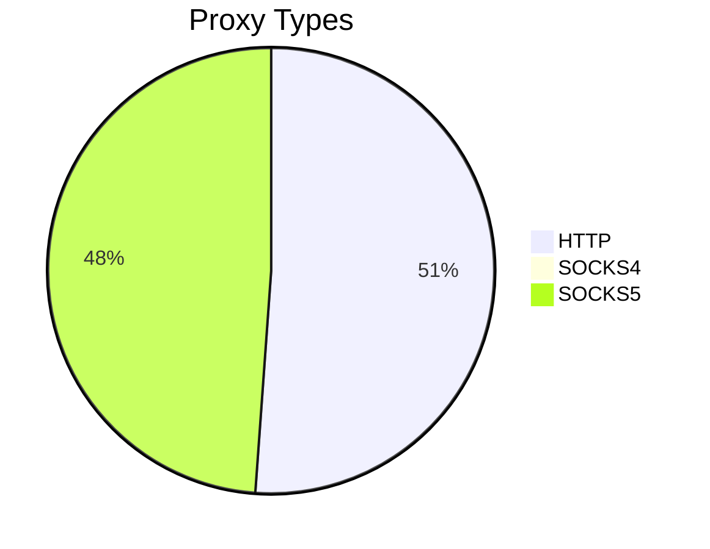
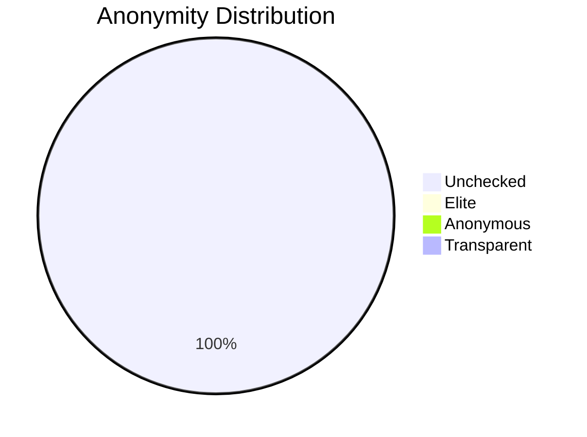

# 🚀 Proxy Collection

## 📊 Statistics

| Metric | Value |
|--------|-------|
| Total Checked | 33131 |
| Working | 1065 |
| Success Rate | 3.21% |

## 📈 Proxy Types Distribution

```mermaid
pie title Proxy Types
    "HTTP" : 540
    "SOCKS4" : 9
    "SOCKS5" : 516
```

## 🔒 Anonymity Levels

```mermaid
pie title Anonymity Distribution
    "Unchecked": 1065
    "Elite" : 0
    "Anonymous" : 0
    "Transparent" : 0
```

## 📝 Description

This repository contains an up-to-date list of verified and working proxies. The list is automatically updated every 30 minutes to ensure maximum data relevance.

## 📋 Contents

- `working_proxies.txt` - list of verified and working proxies with their types and anonymity levels

## 🔄 Automatic Updates

- ⏰ Updates every 30 minutes
- ✅ Automatic proxy validation
- 📈 Real-time statistics
- 🔍 Thorough validation process

## ⚠️ Disclaimer

Proxies are provided "as is", without any warranties. Use them at your own risk.

## 📄 License

MIT License

---

  
**Last Update:** 05.04.2026 05:39:41

